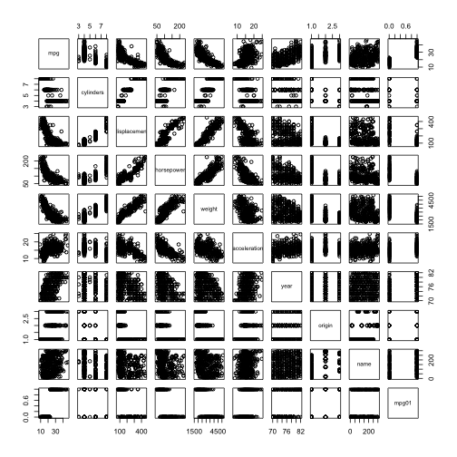

11
========================================================

### a

```r
library(ISLR)
summary(Auto)
```

```
##       mpg         cylinders     displacement   horsepower   
##  Min.   : 9.0   Min.   :3.00   Min.   : 68   Min.   : 46.0  
##  1st Qu.:17.0   1st Qu.:4.00   1st Qu.:105   1st Qu.: 75.0  
##  Median :22.8   Median :4.00   Median :151   Median : 93.5  
##  Mean   :23.4   Mean   :5.47   Mean   :194   Mean   :104.5  
##  3rd Qu.:29.0   3rd Qu.:8.00   3rd Qu.:276   3rd Qu.:126.0  
##  Max.   :46.6   Max.   :8.00   Max.   :455   Max.   :230.0  
##                                                             
##      weight      acceleration       year        origin    
##  Min.   :1613   Min.   : 8.0   Min.   :70   Min.   :1.00  
##  1st Qu.:2225   1st Qu.:13.8   1st Qu.:73   1st Qu.:1.00  
##  Median :2804   Median :15.5   Median :76   Median :1.00  
##  Mean   :2978   Mean   :15.5   Mean   :76   Mean   :1.58  
##  3rd Qu.:3615   3rd Qu.:17.0   3rd Qu.:79   3rd Qu.:2.00  
##  Max.   :5140   Max.   :24.8   Max.   :82   Max.   :3.00  
##                                                           
##                  name    
##  amc matador       :  5  
##  ford pinto        :  5  
##  toyota corolla    :  5  
##  amc gremlin       :  4  
##  amc hornet        :  4  
##  chevrolet chevette:  4  
##  (Other)           :365
```

```r
attach(Auto)
mpg01 = rep(0, length(mpg))
mpg01[mpg > median(mpg)] = 1
Auto = data.frame(Auto, mpg01)
```


### b

```r
cor(Auto[, -9])
```

```
##                  mpg cylinders displacement horsepower  weight
## mpg           1.0000   -0.7776      -0.8051    -0.7784 -0.8322
## cylinders    -0.7776    1.0000       0.9508     0.8430  0.8975
## displacement -0.8051    0.9508       1.0000     0.8973  0.9330
## horsepower   -0.7784    0.8430       0.8973     1.0000  0.8645
## weight       -0.8322    0.8975       0.9330     0.8645  1.0000
## acceleration  0.4233   -0.5047      -0.5438    -0.6892 -0.4168
## year          0.5805   -0.3456      -0.3699    -0.4164 -0.3091
## origin        0.5652   -0.5689      -0.6145    -0.4552 -0.5850
## mpg01         0.8369   -0.7592      -0.7535    -0.6671 -0.7578
##              acceleration    year  origin   mpg01
## mpg                0.4233  0.5805  0.5652  0.8369
## cylinders         -0.5047 -0.3456 -0.5689 -0.7592
## displacement      -0.5438 -0.3699 -0.6145 -0.7535
## horsepower        -0.6892 -0.4164 -0.4552 -0.6671
## weight            -0.4168 -0.3091 -0.5850 -0.7578
## acceleration       1.0000  0.2903  0.2127  0.3468
## year               0.2903  1.0000  0.1815  0.4299
## origin             0.2127  0.1815  1.0000  0.5137
## mpg01              0.3468  0.4299  0.5137  1.0000
```

```r
pairs(Auto)  # doesn't work well since mpg01 is 0 or 1
```

 

Anti-correlated with cylinders, weight, displacement, horsepower.
(mpg, of course)

### c

```r
train = (year%%2 == 0)  # if the year is even
test = !train
Auto.train = Auto[train, ]
Auto.test = Auto[test, ]
mpg01.test = mpg01[test]
```


### d

```r
# LDA
library(MASS)
lda.fit = lda(mpg01 ~ cylinders + weight + displacement + horsepower, data = Auto, 
    subset = train)
lda.pred = predict(lda.fit, Auto.test)
mean(lda.pred$class != mpg01.test)
```

```
## [1] 0.1264
```

12.6% test error rate.

### e

```r
# QDA
qda.fit = qda(mpg01 ~ cylinders + weight + displacement + horsepower, data = Auto, 
    subset = train)
qda.pred = predict(qda.fit, Auto.test)
mean(qda.pred$class != mpg01.test)
```

```
## [1] 0.1319
```

13.2% test error rate.

### f

```r
# Logistic regression
glm.fit = glm(mpg01 ~ cylinders + weight + displacement + horsepower, data = Auto, 
    family = binomial, subset = train)
glm.probs = predict(glm.fit, Auto.test, type = "response")
glm.pred = rep(0, length(glm.probs))
glm.pred[glm.probs > 0.5] = 1
mean(glm.pred != mpg01.test)
```

```
## [1] 0.1209
```

12.1% test error rate.

### g

```r
library(class)
train.X = cbind(cylinders, weight, displacement, horsepower)[train, ]
test.X = cbind(cylinders, weight, displacement, horsepower)[test, ]
train.mpg01 = mpg01[train]
set.seed(1)
# KNN(k=1)
knn.pred = knn(train.X, test.X, train.mpg01, k = 1)
mean(knn.pred != mpg01.test)
```

```
## [1] 0.1538
```

```r
# KNN(k=10)
knn.pred = knn(train.X, test.X, train.mpg01, k = 10)
mean(knn.pred != mpg01.test)
```

```
## [1] 0.1648
```

```r
# KNN(k=100)
knn.pred = knn(train.X, test.X, train.mpg01, k = 100)
mean(knn.pred != mpg01.test)
```

```
## [1] 0.1429
```

k=1, 15.4% test error rate.
k=10, 16.5% test error rate.
k=100, 14.3% test error rate.
K of 100 seems to perform the best. 100 nearest neighbors.
