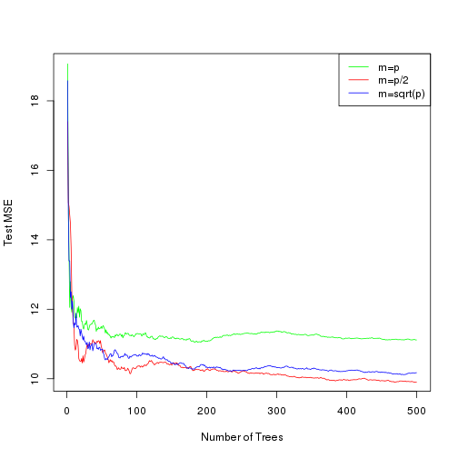

Chapter 8: Exercise 7
========================================================

We will try a range of $\tt{ntree}$ from 1 to 500 and $\tt{mtry}$ taking typical values of $p$, $p/2$, $\sqrt{p}$. For Boston data, $p = 13$. We use an alternate call to $\tt{randomForest}$ which takes $\tt{xtest}$ and $\tt{ytest}$ as additional arguments and computes test MSE on-the-fly. Test MSE of all tree sizes can be obtained by accessing $\tt{mse}$ list member of $\tt{test}$ list member of the model.


```r
library(MASS)
library(randomForest)
```

```
## randomForest 4.6-7
## Type rfNews() to see new features/changes/bug fixes.
```

```r
set.seed(1101)

# Construct the train and test matrices
train = sample(dim(Boston)[1], dim(Boston)[1]/2)
X.train = Boston[train, -14]
X.test = Boston[-train, -14]
Y.train = Boston[train, 14]
Y.test = Boston[-train, 14]

p = dim(Boston)[2] - 1
p.2 = p/2
p.sq = sqrt(p)

rf.boston.p = randomForest(X.train, Y.train, xtest = X.test, ytest = Y.test, 
    mtry = p, ntree = 500)
rf.boston.p.2 = randomForest(X.train, Y.train, xtest = X.test, ytest = Y.test, 
    mtry = p.2, ntree = 500)
rf.boston.p.sq = randomForest(X.train, Y.train, xtest = X.test, ytest = Y.test, 
    mtry = p.sq, ntree = 500)

plot(1:500, rf.boston.p$test$mse, col = "green", type = "l", xlab = "Number of Trees", 
    ylab = "Test MSE", ylim = c(10, 19))
lines(1:500, rf.boston.p.2$test$mse, col = "red", type = "l")
lines(1:500, rf.boston.p.sq$test$mse, col = "blue", type = "l")
legend("topright", c("m=p", "m=p/2", "m=sqrt(p)"), col = c("green", "red", "blue"), 
    cex = 1, lty = 1)
```

 

The plot shows that test MSE for single tree is quite high (around 18). It is reduced by adding more trees to the model and stabilizes around a few hundred trees. Test MSE for including all variables at split is slightly higher (around 11) as compared to both using half or square-root number of variables (both slightly less than 10). 

